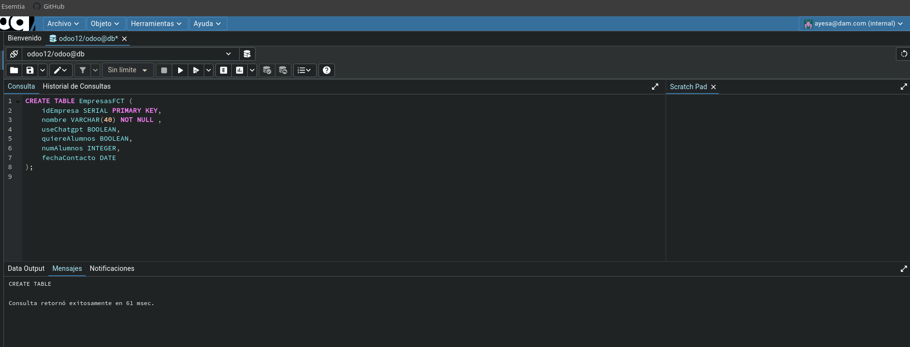
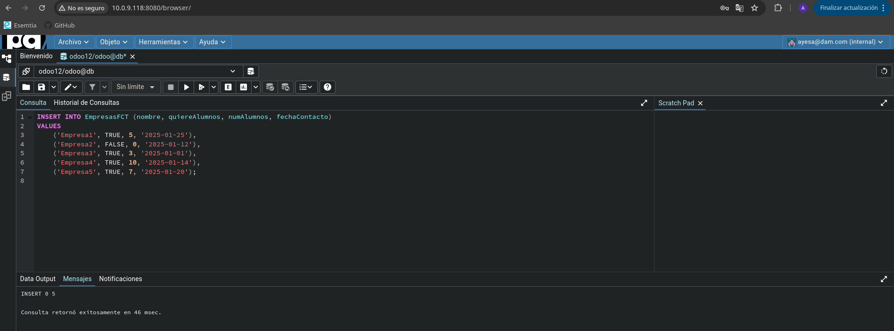

# Tarea 12

Realiza una instalación limpia de una base de datos y marca la opción de “Demo
data”. Posteriormente instala las aplicaciones de facturación y contactos.

## Apartado 1
Mediante la
herramienta PgAdmin u otro método que estimes oportuno, elabora y ejecuta una
sentencia que cree una tabla llamada “EmpresasFCT“con los siguientes campos:

    ● idEmpresa: autonumérico. Este campo será la clave primaria.
    ● nombre: Texto con tamaño máximo de 40 caracteres. -useChatgpt: booleano, por defecto a true
    ● quiereAlumnos: Booleano.
    ● numAlumnos: número entero.
    ● fechaContacto: tipo fecha.

```sql
CREATE TABLE EmpresasFCT (
    idEmpresa SERIAL PRIMARY KEY,
    nombre VARCHAR(40) NOT NULL ,
    useChatgpt BOOLEAN,
    quiereAlumnos BOOLEAN,
    numAlumnos INTEGER,
    fechaContacto DATE
);
```


## Apartado 2

Inserta 5 registros inventados en la tabla a través de una sentencia SQL.

```sql
INSERT INTO EmpresasFCT (nombre, quiereAlumnos, numAlumnos, fechaContacto)
VALUES
    ('Empresa1', TRUE, 5, '2025-01-25'),
    ('Empresa2', FALSE, 0, '2025-01-12'),
    ('Empresa3', TRUE, 3, '2025-01-01'),
    ('Empresa4', TRUE, 10, '2025-01-14'),
    ('Empresa5', TRUE, 7, '2025-01-20');
```

