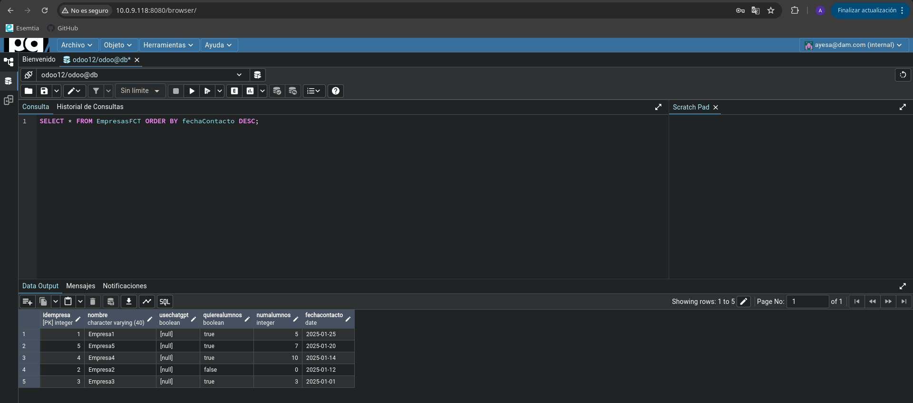
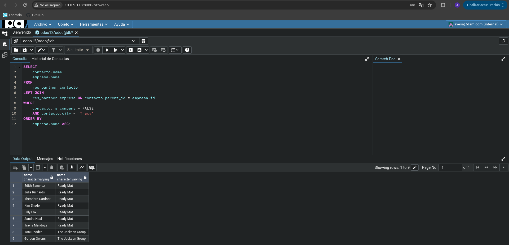
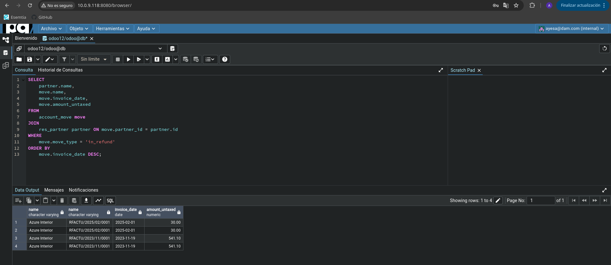

# Tarea 12

Realiza una instalación limpia de una base de datos y mar
ca la opción de “Demo
data”. Posteriormente instala las aplicaciones de facturación y contactos.

## Apartado 1

Mediante la
herramienta PgAdmin u otro método que estimes oportuno, elabora y ejecuta una
sentencia que cree una tabla llamada “EmpresasFCT“con los siguientes campos:

    ● idEmpresa: autonumérico. Este campo será la clave primaria.
    ● nombre: Texto con tamaño máximo de 40 caracteres. -useChatgpt: booleano, por defecto a true
    ● quiereAlumnos: Booleano.
    ● numAlumnos: número entero.
    ● fechaContacto: tipo fecha.

```sql
CREATE TABLE EmpresasFCT (
    idEmpresa SERIAL PRIMARY KEY,
    nombre VARCHAR(40) NOT NULL ,
    useChatgpt BOOLEAN,
    quiereAlumnos BOOLEAN,
    numAlumnos INTEGER,
    fechaContacto DATE
);
```


## Apartado 2

Inserta 5 registros inventados en la tabla a través de una sentencia SQL.

```sql
INSERT INTO EmpresasFCT (nombre, quiereAlumnos, numAlumnos, fechaContacto)
VALUES
    ('Empresa1', TRUE, 5, '2025-01-25'),
    ('Empresa2', FALSE, 0, '2025-01-12'),
    ('Empresa3', TRUE, 3, '2025-01-01'),
    ('Empresa4', TRUE, 10, '2025-01-14'),
    ('Empresa5', TRUE, 7, '2025-01-20');
```


## Apartado 3

Realiza una consulta donde se muestren todos los datos de la tabla EmpresasFCT
ordenados por fechaContacto, de modo que en la primera fila salga el que tenga la
fecha más reciente.

```sql
SELECT * FROM EmpresasFCT ORDER BY fechaContacto DESC;
```


## Apartado 4

Realiza una consulta que permita obtener un listado de todos los contactos de
Odoo (no empresas) con la siguiente información:
- Nombre
- Cuya ciudad sea Tracy, y código postal 95304
- Nombre comercial de la empresa
  ordenados alfabéticamente por el nombre comercial de la empresa

```sql
SELECT
    contacto.name,
    empresa.name
FROM
    res_partner contacto
        LEFT JOIN
    res_partner empresa ON contacto.parent_id = empresa.id
WHERE
    contacto.is_company = FALSE
  AND contacto.city = 'Tracy'
ORDER BY
    empresa.name ASC;
```


## Apartado 5

Utilizando las tablas de odoo, obtén un listado de empresas proveedoras, que han
emitido algún reembolso (facturas rectificativas de proveedor)
- Nombre de la empresa
- Número de factura
- Fecha de la factura-total de factura con impuestos
- Total factura SIN impuestos
  Ordenadas por fecha de factura de modo que la primera sea la más reciente.

```sql
SELECT 
    partner.name, 
    move.name, 
    move.invoice_date, 
    move.amount_untaxed
FROM 
    account_move move
JOIN 
    res_partner partner ON move.partner_id = partner.id
WHERE 
    move.move_type = 'in_refund'
ORDER BY 
    move.invoice_date DESC;
```
